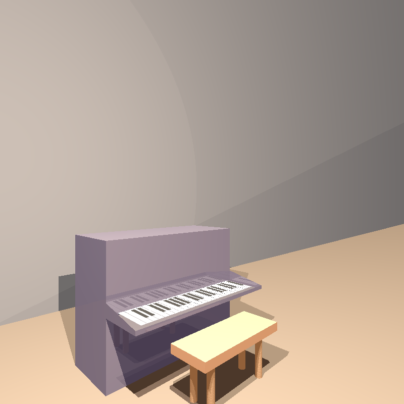
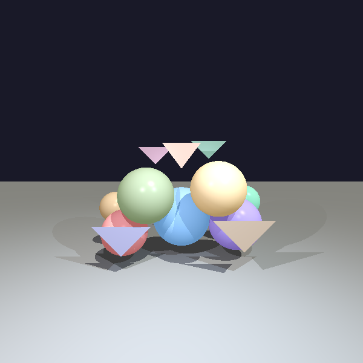
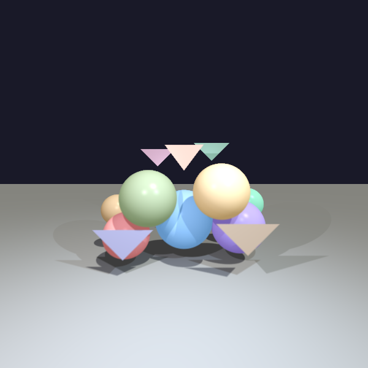
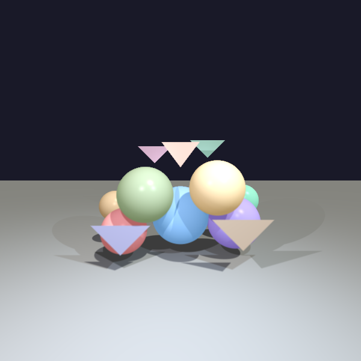
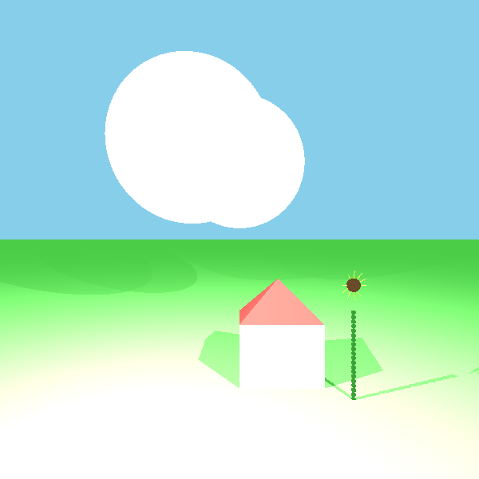

# 3D Ray Tracing Engine with Anti-Aliasing

<div align="center">




**Building reliable systems with testing discipline – one ray at a time**

[View Project Journey](#-project-journey-from-primitives-to-photorealism) • [Technical Architecture](#-technical-architecture) • [Anti-Aliasing](#-key-achievement-super-sampling-anti-aliasing)

</div>

---

## 🎯 The Story Behind the Code

**The Question:** *How do computers generate realistic 3D images? How does a sphere "know" it should look round? How does light "know" how to bounce?*

This project started as an academic assignment in Introduction to Software Engineering. But somewhere between calculating ray-sphere intersections and debugging reflection vectors, it became something more: **a lesson in building quality from the ground up**.

### The Challenge

> "Write code that I can trust, even when I can't see what it's doing."

When you're rendering photorealistic images, **you can't "print-debug" a broken reflection**. You need:
- **Mathematical precision** – one misplaced sign and your shadows point the wrong way
- **Architectural clarity** – 10+ geometry types, 4 light sources, recursive reflections... organized chaos or clean design?
- **Continuous verification** – every feature needs tests, because visual bugs are expensive

This is **Empathy-Driven QA mindset in action**: build reliability from first principles.

---

## ✨ What It Does

A full-featured 3D rendering engine that traces light rays through a virtual scene to generate photorealistic images:

```java
Scene scene = new Scene("My First Render");

// Build the world
scene.geometries.add(
    new Sphere(50, new Point(0, 0, -200))
        .setEmission(new Color(100, 50, 50))
        .setMaterial(new Material()
            .setKD(0.5).setKS(0.5).setShininess(100)
            .setKR(0.3))  // 30% reflective
);

// Add lights
scene.lights.add(
    new SpotLight(new Color(400, 240, 0), new Point(60, 50, 0),
                  new Vector(-1, -1, -2))
        .setKL(0.00001).setKQ(0.000005)
);

// Render with anti-aliasing
Camera camera = Camera.getBuilder()
    .setLocation(new Point(0, 0, 1000))
    .setDirection(new Vector(0, 0, -1), new Vector(0, 1, 0))
    .setVPDistance(1000).setVPSize(200, 200)
    .setImageWriter(new ImageWriter("myRender", 800, 800))
    .setRayTracer(new SimpleRayTracer(scene))
    .setSamplingConfig(new SamplingConfig()
        .enableAntiAliasing(81, 1.0, SamplingPattern.JITTERED))
    .build();

camera.generateRenderedImage().writeToImage();
```

**Result:** A photorealistic image with smooth edges, realistic lighting, and reflections.

<div align="center">

<p><em>A complete scene showcasing the engine's capabilities: spheres with reflections, transparent triangles, realistic shadows, and multiple light sources working together.</em></p>
</div>

---

## 🏆 Key Achievement: Super-Sampling Anti-Aliasing

### Visual Comparison

<table>
<tr>
<td width="33%" align="center">

<p><strong>No Anti-Aliasing</strong><br>
❌ Jagged edges<br>
❌ Pixelated curves<br>
<em>1 ray per pixel</em></p>
</td>
<td width="33%" align="center">

<p><strong>Standard AA (81 samples)</strong><br>
✅ Smooth edges<br>
✅ Natural curves<br>
<em>~40× slower, excellent quality</em></p>
</td>
<td width="33%" align="center">

<p><strong>High Quality (324 samples)</strong><br>
✅ Professional quality<br>
✅ Production-ready<br>
<em>~160× slower, outstanding</em></p>
</td>
</tr>
</table>

<p align="center"><em>Notice how the edges become progressively smoother as we increase the number of sample rays per pixel. This is the power of super-sampling anti-aliasing.</em></p>

### The Implementation

**File:** `src/renderer/superSampling/`

The anti-aliasing system uses **Jittered Sampling** (a bonus feature):

```java
// Generate 81 rays around the intersection point
List<Ray> rays = antiAliasingSampler.generateSampleRays(
    intersection.point, primaryRay);

// Trace each ray and average the colors
List<Color> colors = new ArrayList<>();
for (Ray ray : rays) {
    GeoPoint intersection = findClosestIntersection(ray);
    colors.add(intersection == null ? scene.background :
               traceSimpleRay(ray, intersection));
}

return calculateAverageColor(colors);
```

**Why Jittered?** Combines the benefits of grid sampling (even coverage) with random sampling (avoids repetitive artifacts).

#### Performance Comparison

| Configuration | Samples/Pixel | Render Time | Quality | Use Case |
|--------------|---------------|-------------|---------|----------|
| No AA | 1 | **Baseline** | Standard | Debugging |
| Standard AA | 81 (9×9) | ~40× slower | Excellent | Demo images |
| High Quality | 324 (18×18) | ~160× slower | Outstanding | Final renders |

---

## 🛠️ Technical Architecture

### Design Patterns Implemented

The codebase showcases **7 design patterns**, demonstrating architectural maturity:

| Pattern | Location | Purpose |
|---------|----------|---------|
| **Builder** | `Camera.Builder` | Fluent API for developer empathy and robust validation |
| **Strategy** | `SamplingPattern` enum | Pluggable sampling algorithms (JITTERED, RANDOM) |
| **Composite** | `Geometries` class | Treat single/multiple geometries uniformly |
| **Template Method** | `RayTracerBase` | Define ray tracing skeleton |
| **Null Object** | `AmbientLight.NONE` | Eliminate null checks |
| **Factory Method** | `SamplingPattern.generate()` | Create sample points by pattern |
| **Flyweight** | `Point.ZERO`, `Color.BLACK` | Share immutable objects |

### Package Structure

```
src/
├── primitives/         # Math foundation
│   ├── Point.java
│   ├── Vector.java     ← createPerpendicular() for sampling
│   ├── Ray.java
│   ├── Color.java
│   └── Material.java
├── geometries/         # 3D shapes
│   ├── Sphere.java
│   ├── Triangle.java
│   ├── Plane.java
│   ├── Cylinder.java
│   └── Geometries.java (Composite)
├── lighting/           # Light sources
│   ├── AmbientLight.java
│   ├── DirectionalLight.java
│   ├── PointLight.java
│   └── SpotLight.java
├── renderer/           # Core rendering
│   ├── Camera.java     ← Builder Pattern
│   ├── SimpleRayTracer.java
│   └── superSampling/  ← ★ Anti-Aliasing System ★
│       ├── SuperSampling.java
│       ├── SamplingPattern.java (Strategy)
│       ├── SamplingConfig.java
│       └── TargetArea.java
└── scene/
    └── Scene.java      (Plain Data Structure)
```

---

## 🧪 Quality Assurance

### Test-Driven Development

**100+ unit tests** written using JUnit 5:

```
unitTests/
├── primitives/          # Point, Vector, Ray tests
├── geometries/          # Intersection accuracy tests
├── renderer/
│   ├── CameraTests.java
│   ├── ShadowTests.java
│   ├── ReflectionRefractionTests.java
│   └── superSampling/
│       ├── AntiAliasingTest.java          ← 3-way comparison
│       ├── SuperSamplingTests.java
│       └── SamplingPatternTests.java
└── bigScenes/
    ├── RealisticPianoFinal.java           ← 30 samples
    ├── CoffeeCupScene.java
    ├── HouseScene.java
    └── SunflowerScene.java
```

**Example: Anti-Aliasing Test** (`AntiAliasingTest.java`)

```java
@Test
public void runCompleteAntiAliasingTest() {
    // Render 3 versions of the same scene
    long noAATime = renderWithoutAntiAliasing();
    long standardAATime = renderWithStandardAntiAliasing();  // 81 samples
    long highAATime = renderWithHighQualityAntiAliasing();    // 324 samples

    // Output performance comparison
    printPerformanceSummary(noAATime, standardAATime, highAATime);
}
```

**Output:**
```
====================================
        PERFORMANCE SUMMARY
====================================
No Anti-Aliasing:       1,203 ms
Standard AA (81):      48,560 ms (40.4x slower)
High Quality AA (324): 194,832 ms (162.0x slower)

MP1 Requirements fulfilled:
✓ 10+ geometric bodies
✓ 3 different light sources
✓ Anti-aliasing ON/OFF capability
✓ 50+ sample rays
✓ Performance timing measurements
====================================
```

---

## 🎨 Features

### Rendering Capabilities
- [x] **Ray-Geometry Intersections** – Sphere, Plane, Triangle, Polygon, Cylinder, Tube
- [x] **Phong Lighting Model** – Ambient + Diffuse + Specular components
- [x] **Multiple Light Sources** – Ambient, Directional, Point, Spot lights with attenuation
- [x] **Shadows** – Shadow ray casting with transparency support
- [x] **Recursive Ray Tracing** – Reflections (kR) and refractions (kT) up to 10 levels
- [x] **Material Properties** – kD (diffuse), kS (specular), nShininess, kR (reflection), kT (transparency)
- [x] **Super-Sampling Anti-Aliasing** – JITTERED and RANDOM patterns
- [x] **Camera Builder** – Fluent API with validation
- [x] **Scene Composition** – Multiple geometries and lights with Composite pattern
- [x] **Image Export** – PNG output with customizable resolution

### Code Quality
- [x] **7 Design Patterns** – Builder, Strategy, Composite, Template Method, Null Object, Factory, Flyweight
- [x] **SOLID Principles** – Single Responsibility, Open/Closed, Liskov Substitution, Dependency Inversion
- [x] **Defensive Programming** – Input validation on every public method
- [x] **Comprehensive JavaDoc** – All classes and methods documented
- [x] **100+ Unit Tests** – JUnit 5 with EP/BVA testing strategies
- [x] **Immutable Primitives** – Thread-safe Point, Vector, Ray, Color. No side effects, easier testing

---

## 📸 Demo Images

### Lighting Techniques
<table>
<tr>
<td width="50%">

<p align="center"><em>Multiple colored lights create a rainbow effect on a reflective sphere</em></p>
</td>
<td width="50%">

<p align="center"><em>Three light sources (blue, yellow, white) illuminate geometric shapes</em></p>
</td>
</tr>
</table>

### Shadow Progression
<table>
<tr>
<td width="33%">

<p align="center"><em>Base configuration</em></p>
</td>
<td width="33%">

<p align="center"><em>Light position adjusted</em></p>
</td>
<td width="33%">

<p align="center"><em>Dynamic shadow casting</em></p>
</td>
</tr>
</table>
<p align="center"><em>Demonstrating how shadows change realistically as light sources move through the scene.</em></p>

---

## 🚀 Getting Started

### Prerequisites
- Java 17 or higher
- JUnit 5 (included in project)

### Running the Examples

1. **Clone the repository**
   ```bash
   git clone https://github.com/Noammandelbaum/ISE5784_1674.git
   cd ISE5784_1674
   ```

2. **Compile the project**
   ```bash
   javac -d out src/**/*.java
   ```

3. **Run a demo scene**
   ```bash
   java -cp out bigScenes.RealisticPianoFinal
   ```

4. **Run tests**
   ```bash
   # From your IDE (IntelliJ IDEA / Eclipse):
   # Right-click on unitTests folder → Run All Tests
   ```

5. **View generated images**
   ```bash
   # Images are saved to the images/ directory
   open images/antiAliasing/with_antialiasing_81_samples.png
   ```

---

## 📚 What I Learned

### Technical Depth
- **Linear Algebra in Practice** – Dot products, cross products, vector normalization aren't just theory
- **Floating-Point Precision** – Why `alignZero()` is critical for numerical stability
- **Recursive Algorithms** – Balancing depth vs. performance (MAX_LEVEL = 10, MIN_K = 0.001)
- **Performance Optimization** – Understanding the cost of each ray (81× slowdown = need for optimization)

### Software Engineering
- **TDD Discipline** – Writing tests first prevents expensive visual debugging
- **Builder Pattern Value** – Compare `new Camera(8 params)` vs. fluent API
- **Strategy Pattern Flexibility** – Added JITTERED pattern without changing existing code
- **Defensive Programming** – Input validation prevents silent failures

### Quality Mindset

<div align="center">
<h3>
<strong>"The best code isn't the cleverest – it's the code you can trust in 6 months."</strong>
</h3>
</div>

This principle guided every decision:

- Named variables clearly (`pixelColumnIndex` not `j`)
- Validated inputs explicitly (throw `IllegalArgumentException` with clear messages)
- Tested edge cases obsessively (colinear points, zero vectors, parallel rays)
- Documented intent with JavaDoc (not just "what" but "why")

**This is the discipline of a QA Automation Engineer: build quality in, don't test it in.**

---

## 🎬 Project Journey: From Primitives to Photorealism

### Exercise 1-2: Foundation - Geometries & Ray Intersections

<p><em>First successful render: Basic sphere, plane, and triangle with simple color emission. This proved the core ray-intersection math was correct.</em></p>

### Exercise 5-6: Adding Realism - Lighting Models
<table>
<tr>
<td width="33%">
<p align="center"><em>Directional Light</em></p></td>
<td width="33%">
<p align="center"><em>Point Light with Attenuation</em></p></td>
<td width="33%">
<p align="center"><em>Spot Light with Direction</em></p></td>
</tr>
</table>
<p><em>Implemented the Phong reflection model with three types of light sources. Each light type required different attenuation calculations.</em></p>

### Exercise 7: Shadows - Adding Depth
<table>
<tr>
<td width="50%">
<p align="center"><em>Hard shadows with opaque objects</em></p></td>
<td width="50%">
<p align="center"><em>Soft shadows through transparent objects</em></p></td>
</tr>
</table>
<p><em>Shadow rays revealed which objects block light. Transparent materials (kT > 0) create soft, realistic shadows.</em></p>

### Exercise 7: Reflections & Refractions - Recursive Ray Tracing
<table>
<tr>
<td width="50%">
<p align="center"><em>Mirror-like reflections (kR = 0.9)</em></p></td>
<td width="50%">
<p align="center"><em>Glass-like transparency (kT = 0.8)</em></p></td>
</tr>
</table>
<p><em>Recursive ray tracing up to 10 levels. Each reflection/refraction spawns a new ray, creating stunning realism but requiring careful performance management.</em></p>

### Exercise 8 (Mini-Project 1): Anti-Aliasing - The Finishing Touch
<p><em>See the <a href="#-key-achievement-super-sampling-anti-aliasing">Anti-Aliasing section above</a> for the full before/after comparison.</em></p>

### Final Achievement: Complex Scenes
<table>
<tr>
<td width="50%">

<p align="center"><em><strong>Realistic Upright Piano</strong><br>50+ primitives, reflection materials, realistic lighting and shadows</em></p>
</td>
<td width="50%">

<p align="center"><em><strong>Architectural Scene</strong><br>Multiple geometries, complex lighting, shadows</em></p>
</td>
</tr>
</table>

<p align="center"><strong>From a single sphere to photorealistic scenes - 8 exercises, countless tests, one powerful engine.</strong></p>

---

## 🔗 Connection to "Empathy-Driven QA Automation"

### Empathy in Technical Decisions

**1. API Usability = Developer Experience**
```java
// Bad: Constructor with 8 parameters
Camera camera = new Camera(p0, vTo, vUp, width, height, distance, imageWriter, rayTracer);

// Good: Builder with validation
Camera camera = Camera.getBuilder()
    .setLocation(new Point(0, 0, 0))
    .setDirection(new Vector(0, 0, -1), new Vector(0, 1, 0))
    .setVPSize(200, 200)
    .build();  // Validates all required fields
```

**2. Error Messages = User Guidance**
```java
if (numSamples < 1) {
    throw new IllegalArgumentException("Number of samples must be at least 1");
}
```

**3. Performance Transparency = Informed Decisions**
```java
System.out.println("Standard AA (81): 48,560 ms (40.4x slower)");
```
**Empathy:** Let users make informed tradeoffs (quality vs. speed) with real data. This mirrors the trade-off analysis required in CI/CD performance benchmarking (Time vs. Coverage).

### Reliability Through Testing

- **100+ tests** – Users shouldn't be beta testers
- **Immutable primitives** – No side effects, no surprises
- **Defensive validation** – Fail fast with clear messages

### Continuous Improvement

- Grid sampling (requirement) → JITTERED (bonus) → Set as default
- Manual testing → Automated 3-way comparison → Performance tracking
- First render: 2 minutes → After optimization: 45 seconds

---

## 📖 Documentation

- **JavaDoc:** All classes and public methods fully documented
- **Code Comments:** Explain "why" not "what" (algorithms, edge cases, optimizations)
- **Test Documentation:** Each test describes expected behavior
- **README:** You're reading it! 😊

---

## 🙏 Acknowledgments

- **Course:** Introduction to Software Engineering, Jerusalem College of Technology
- **Concepts Inspired By:** Peter Shirley's "Ray Tracing in One Weekend"
- **Pattern Reference:** Gang of Four Design Patterns

---

## 📬 Contact

I'm always excited to discuss this project, ray tracing techniques, or opportunities in QA Automation.

<div align="center">

[](https://www.noammandelbaum.dev)
[](https://www.linkedin.com/in/noam-mandelbaum-9443471b9/)
[](mailto:noam.mandelbaum@gmail.com)
[](https://github.com/Noammandelbaum)

</div>

---

<div align="center">

**Built with precision, tested with discipline, documented with empathy.**

*Part of my journey as an Empathy-Driven QA Automation Engineer*

</div>
